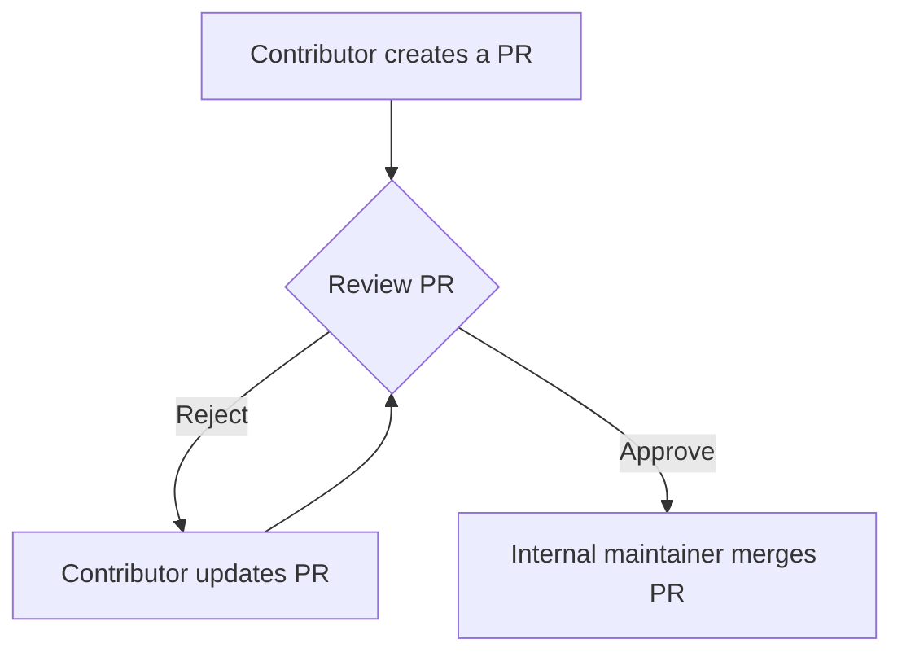

# Contributing Guidelines

Thank you for contributing to this project! To ensure consistency and clarity, please follow these guidelines:

---

## Library Naming Convention
- To keep everyone on the same page, **libraries should be referred to by their folder name** as found in `/libs/**`.
- Note that the folder name may differ from the library's npm package name.

---

## Project Structure
- `libs/` contains all the library projects.
- `src/` is used for testing and creating examples to demonstrate how to use each library.

---

## Documentation
- Each library must have its own `README.md` file located at `/libs/{lib-folder}/README.md` that explains how to use it.

---

## Dependencies
- Any third-party dependency required for a library should be installed as a **development dependency**.
  - Example: If you're adding support for S3 Bucket using the `aws-sdk`, install it as a dev dependency:
    ```bash
    npm install aws-sdk --save-dev
    ```

---

## Branch Naming
- When creating a branch for a library, use the **library folder name as a prefix**.
  - Example: If working on the `notification` library, your branch name should start with `notification/`:
    ```bash
    notification/feature-name
    ```
  - Ensure the prefix matches the exact folder name in `/libs`.

---

## Flow




By adhering to these conventions, we can maintain a clean and consistent workflow. Thank you for your contributions!
